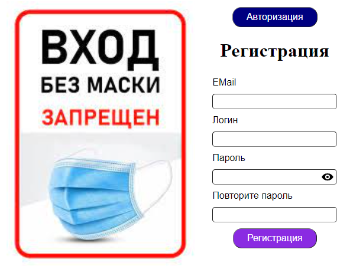
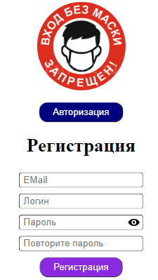
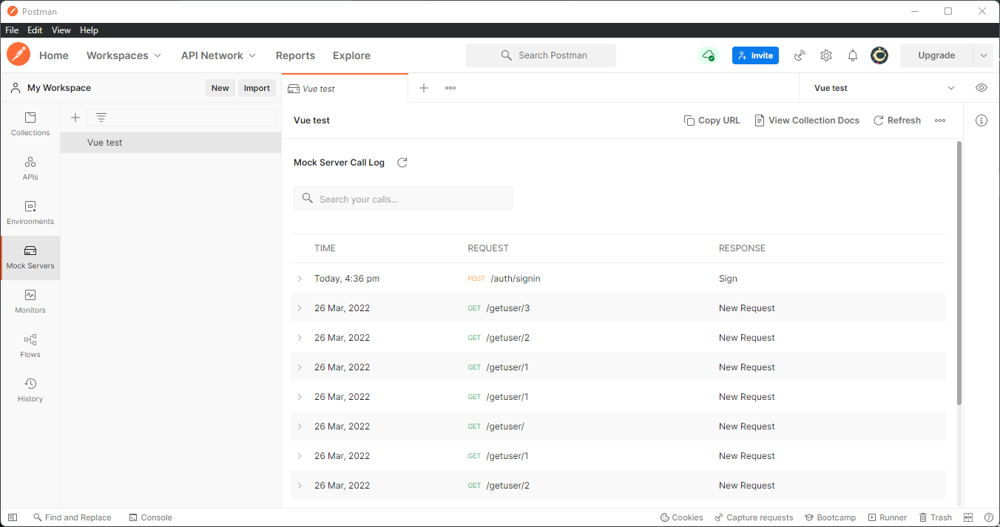
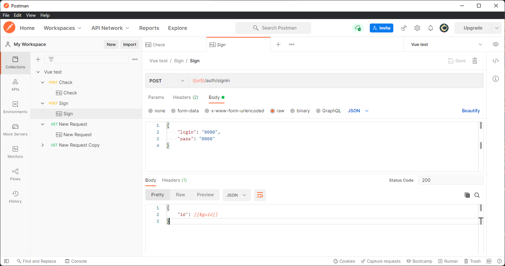
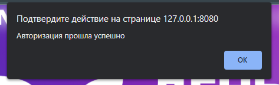
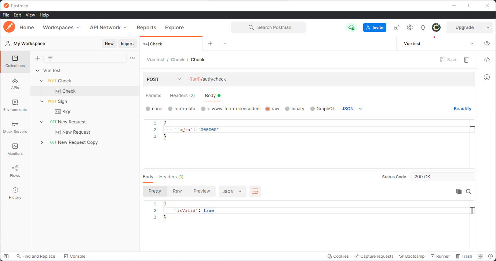
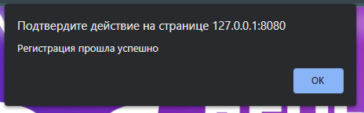
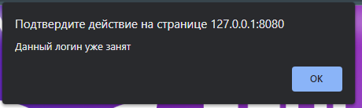

<p align = center>МИНИСТЕРСТВО НАУКИ И ВЫСШЕГО ОБРАЗОВАНИЯ

<p align = center>РОССИЙСКОЙ ФЕДЕРАЦИИ

<p align = center>ФЕДЕРАЛЬНОЕ ГОСУДАРСТВЕННОЕ БЮДЖЕТНОЕ ОБРАЗОВАТЕЛЬНОЕ УЧРЕЖДЕНИЕ ВЫСШЕГО ОБРАЗОВАНИЯ

<p align = center>«ВЯТСКИЙ ГОСУДАРСТВЕННЫЙ УНИВЕРСИТЕТ»

<p align = center>Институт математики и информационных систем

<p align = center>Факультет автоматики и вычислительной техники

<p align = center>Кафедра систем автоматизации управления
<br>
<br>
<br>
<br>

<p align = right>Дата сдачи на проверку:

<p align = right>«___» __________ 2022 г.

<p align = right>Проверено:

<p align = right>«___» __________ 2022 г.
<br>
<br>
<br>
<br>
<br>


<p align = center>Отчет по лабораторной работе № 3

<p align = center>по дисциплине

<p align = center>«Web-программирование»

<br>
<br>
<br>
<br>


<p align = center>Разработал студент гр. ИТб-2301-01-00 ________________ /Кокорин Е.Д./

<p align = center>Проверил ст. преподаватель _________________ /Земцов М.А./

<p align = center>Работа защищена с оценкой «___________» «___» __________ 2022 г.

<br>
<br>
<br>
<br>

<p align = center>Киров 2022

<hr>
Цель:  провести тестирование отправки axios-запроса на mock-сервер

Задачи:

1. Организовать процесс работы над лабораторной работой
1. Сверстать блок регистрации
1. Создать mock-сервер в Postman
1. Отправить запрос на mock-сервер и получить ответ

Ход выполнения:

1. Организовать процесс работы над лабораторной работой

Для работы в репозитории *[ссылка на репозиторий](https://github.com/Danperad/WEB)* на сайте github.com была создана новая ветвь с названием lab3 от ветки lab2.

2. Сверстать блок регистрации

В компонент Registration была добавлена адаптивная верстка блока регистрации. Результут представлен на рисунке 1 и 2.

<p align=center></p>

<p align = center>Рисунок 1 – Регистрация desktop

<p align=center></p>

<p align = center>Рисунок 2 – Регистрация для мобильных устройств

3. Создать mock-сервер в Postman

В ходе выполнения работы с помощью Postman был создан Mock Server. Созданный Mock Server представлен на рисунке 3.

<p align=center></p>

<p align = center>Рисунок 3 – Mock Server

В рамках лабораторной работы были созданы два Post запроса.
В первом случае Post запрос используется для проверки введенного логина и пароля. Реализация запроса изображена на рисунке 4. Результаты его работы показаны на рисунках 5 и 6.

<p align=center></p>

<p align = center>Рисунок 4 – Post запрос

<p align=center></p>

<p align = center>Рисунок 5 – Удачный вход

<p align=center></p>

<p align = center>Рисунок 6 – Неудачный вход

Во втором случае Post запрос используется для проверки уникальности логина при регистрации. Реализация запроса изображена на рисунке 7. Результаты его работы показаны на рисунках 8 и 9.

<p align=center></p>

<p align = center>Рисунок 7 – Post запрос

<p align=center></p>

<p align = center>Рисунок 8 – Удачная регистрация

<p align=center></p>

<p align = center>Рисунок 9 – Неудачная регистрация

В компоненте Registration предусмотрена проверка на ввод почты, пароля и совпадения введенных паролей
Листинг компонента Registration представлен в приложении А.

Вывод: в ходе лабораторной работы было проведено тестирование отправки axios-запроса на mock-сервер.

<p align = center>Приложение А

<p align = center>(обязательное) 

<p align = center>Листинг компонента Regisration.vue

```html
<template>
    <div class="reg-text">
        <h1>Регистрация</h1>
        <div class="reg-div">
            <p v-if="!isMobile">EMail</p>
            <input type="email" id="reg-email">

            <p v-if="!isMobile">Логин</p>
            <input type="text" id="reg-login" v-model="data.login">

            <p v-if="!isMobile">Пароль</p>
            <div class="password">
                <input type="password" id="reg-pass">
                <button v-on:click="changePassVis" id="password"
                        class="password-control"></button>
            </div>

            <p v-if="!isMobile">Повторите пароль</p>
            <input type="password" id="reg-pass2">
        </div>
        <div>
            <input type="button" value="Регистрация" class="reg-btn" v-on:click="regClick">
        </div>
    </div>
</template>

<script lang="ts">
    import {defineComponent} from 'vue';
    import axios from "axios";
    export default defineComponent({
        name: 'Registration',
        data() {
            return {
                isMobile: false,
                width: 0,
                hide: true,
                data: {}
            };
        },
        methods: {
            updateWidth() {
                this.width = window.innerWidth;
                this.isMobile = this.width <= 600;
                const email = document.getElementById("reg-email") as HTMLInputElement;
                const login = document.getElementById("reg-login") as HTMLInputElement;
                const pass = document.getElementById("reg-pass") as HTMLInputElement;
                const pass2 = document.getElementById("reg-pass2") as HTMLInputElement;
                if (this.isMobile) {
                    email.placeholder = "EMail";
                    login.placeholder = "Логин";
                    pass.placeholder = "Пароль";
                    pass2.placeholder = "Повторите пароль";
                } else {
                    email.placeholder = "";
                    login.placeholder = "";
                    pass.placeholder = "";
                    pass2.placeholder = "";
                }
            },
            changePassVis() {
                this.hide = !this.hide;
                let pass: HTMLInputElement;
                let btn: HTMLButtonElement;
                pass = document.getElementById("reg-pass") as HTMLInputElement;
                btn = document.getElementById("password") as HTMLButtonElement;
                if (this.hide) {
                    pass.type = "password";
                    btn.style.background = "url(https://snipp.ru/demo/495/view.svg) 0 0 no-repeat";
                } else {
                    pass.type = "text";
                    btn.style.background = "url(https://snipp.ru/demo/495/no-view.svg) 0 0 no-repeat";
                }
            },
            regClick: function () {
                let email = (document.getElementById('reg-email') as HTMLInputElement).value;
                let login = (document.getElementById('reg-login') as HTMLInputElement).value;
                let pass = (document.getElementById('reg-pass') as HTMLInputElement).value;
                let pass2 = (document.getElementById('reg-pass2') as HTMLInputElement).value;
                if (email.length === 0) {
                    alert("Введите E-Mail");
                    return;
                }
                if (login.length < 6) {
                    alert("Длинна логина должна быть больше 5")
                    return;
                }
                if (pass.length < 8) {
                    alert("Длинна пароля должна быть больше 7")
                    return;
                }
                if (pass !== pass2) {
                    alert("Пароли не совпадают");
                    return;
                }
                const headers = {
                    'Content-Type': 'application/json',
                    'x-mock-match-request-body': 'true'
                };
                const url = 'https://c3d2fd9a-8164-40fd-bbeb-aa7519fbf314.mock.pstmn.io/auth/check';
                axios.post(url, this.data, {headers})
                        .then(
                                (res: any) => {
                                    alert("Данный логин уже занят");
                                },
                        ).catch(
                        (err: any) => {
                            alert("Регистрация прошла успешно");
                        },
                );
            }
        },
        created() {
            this.width = window.innerWidth;
            window.addEventListener('resize', this.updateWidth);
        },
        mounted() {
            this.updateWidth();
        },
        unmounted() {
            window.removeEventListener('resize', this.updateWidth)
        }
    });
</script>

<style scoped>
    .reg-text {
        display: flex;
        align-items: center;
        flex-direction: column;
    }
    .reg-text p {
        font-family: SansSerif, sans-serif;
        margin-top: 5px;
        margin-bottom: 5px;
    }
    .reg-text input[type="text"], .reg-text input[type="password"], .reg-text input[type="email"] {
        border-radius: 5px;
        border-width: thin;
        font-size: medium;
        padding: 3px 7px;
    }
    .reg-btn {
        margin-top: 5px;
        padding: 7px 23px;
        border-radius: 15px;
        border-width: thin;
        font-size: 16px;
        color: white;
        cursor: pointer;
        background-color: blueviolet;
    }
    .reg-div{
        margin: 0 auto;
        display: flex;
        flex-direction: column;
    }
    .reg-div input {
        margin-top: 5px;
        margin-bottom: 5px;
    }
    .password {
        text-align: center;
        position: relative;
    }
    .password-control {
        position: absolute;
        top: 8px;
        right: 6px;
        display: inline-block;
        width: 20px;
        height: 20px;
        background: url(https://snipp.ru/demo/495/view.svg) 0 0 no-repeat;
        border: 0;
    }
</style>
```