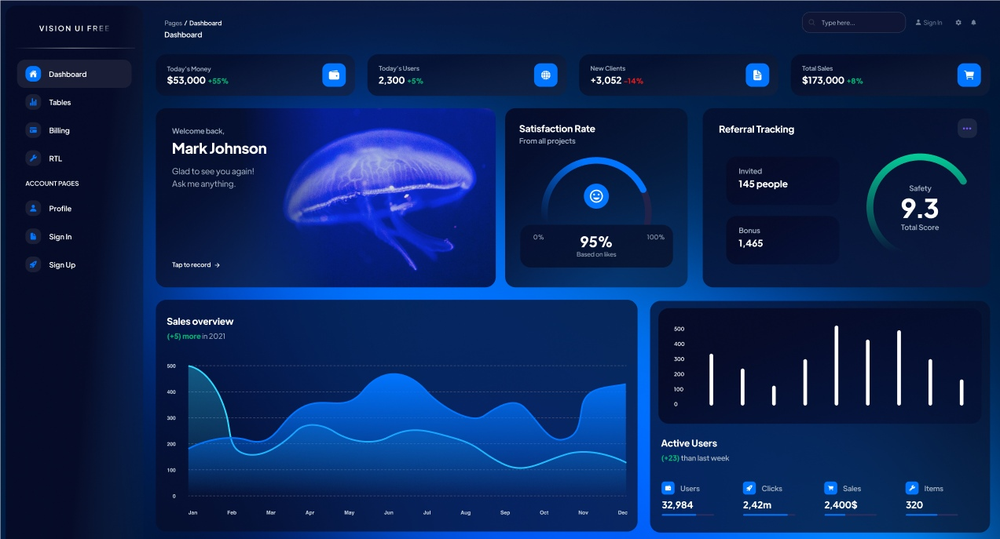
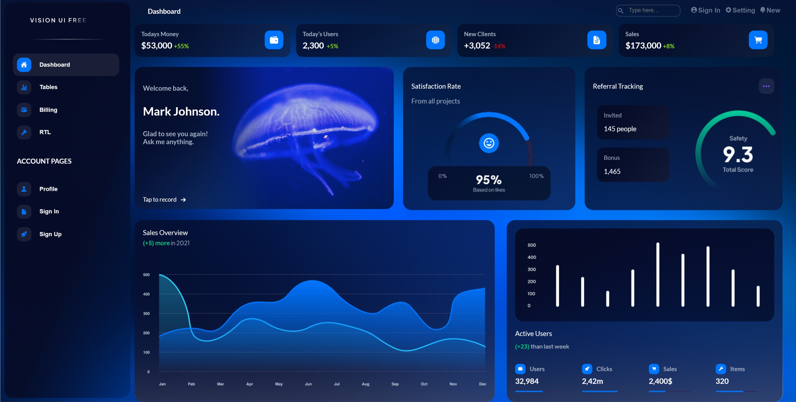
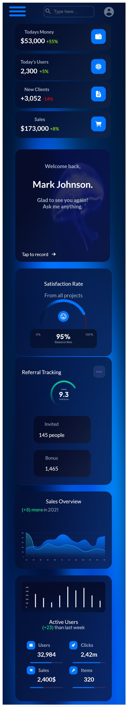
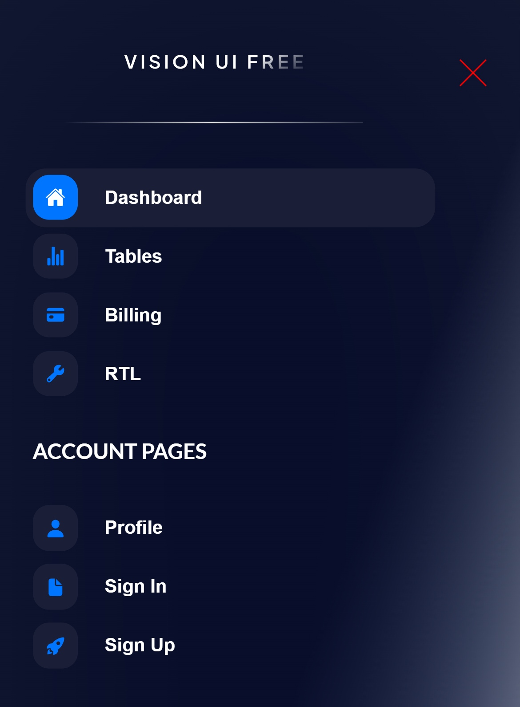
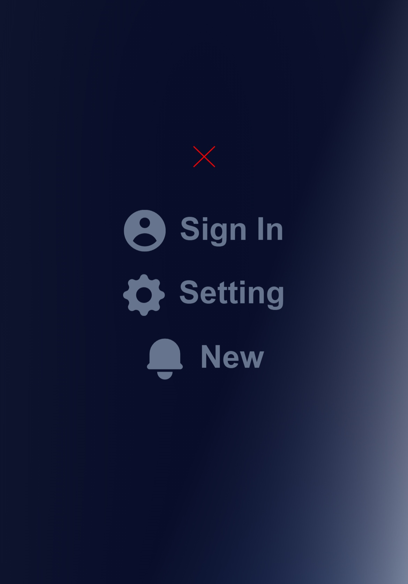

<p align = center>МИНИСТЕРСТВО НАУКИ И ВЫСШЕГО ОБРАЗОВАНИЯ

<p align = center>РОССИЙСКОЙ ФЕДЕРАЦИИ

<p align = center>ФЕДЕРАЛЬНОЕ ГОСУДАРСТВЕННОЕ БЮДЖЕТНОЕ ОБРАЗОВАТЕЛЬНОЕ УЧРЕЖДЕНИЕ ВЫСШЕГО ОБРАЗОВАНИЯ

<p align = center>«ВЯТСКИЙ ГОСУДАРСТВЕННЫЙ УНИВЕРСИТЕТ»

<p align = center>Институт математики и информационных систем

<p align = center>Факультет автоматики и вычислительной техники

<p align = center>Кафедра систем автоматизации управления
<br>
<br>
<br>
<br>

<p align = right>Дата сдачи на проверку:

<p align = right>«___» __________ 2022 г.

<p align = right>Проверено:

<p align = right>«___» __________ 2022 г.
<br>
<br>
<br>
<br>
<br>


<p align = center>Отчет по лабораторной работе № 4

<p align = center>по дисциплине

<p align = center>«Web-программирование»

<br>
<br>
<br>
<br>


<p align = center>Разработал студент гр. ИТб-2301-01-00 ________________ /Кокорин Е.Д./

<p align = center>Проверил ст. преподаватель _________________ /Земцов М.А./

<p align = center>Работа защищена с оценкой «___________» «___» __________ 2022 г.

<br>
<br>
<br>
<br>

<p align = center>Киров 2022

<hr>
Цель:  сверстать макета с помощью фреймворка Vue

Задачи:

1. Организовать процесс работы над лабораторной работой
1. Выбрать dashboard-макет в Figma Community
1. Сверстать dashboard-страницу, разбив её на компоненты Vue
1. Реализовать адаптивную верстку под мобильное устройство

Ход выполнения:

1. Организовать процесс работы над лабораторной работой

Для работы в репозитории *[ссылка на репозиторий](https://github.com/Danperad/WEB)* на сайте github.com была создана новая ветвь с названием lab4. В проект были добавлены компоненты MainDashbord.vue, Header.vue, SideBar.Vue, Dashbord.vue. Листинг компоненита MainDashbord.vue представлен в приложении А.

2. Выбрать dashboard-макет в Figma Community

На электронном ресурсе с готовыми макетами Figma Community был выбран макет, представленный на рисунке 1.


<p align=center></p>

<p align = center>Рисунок 1 – Dashboard-макет 

3. Сверстать dashboard-страницу, разбив её на компоненты Vue

В ходе выполнения работы были выделены логические компоненты макета, а именно: Header, SideBar, Dashbord. Листинги компонентов представлены в приложении Б, приложении В и приложении Г соответственно.

Реализованный макет представлен на рисунке 2.

<p align=center></p>

<p align = center>Рисунок 2 – Dashboard-макет для Desktop

<p align = center>2
<hr>

4. Реализовать адаптивную верстку под мобильное устройство

С помощью медиа запросов была реализована способность страницы адаптироваться под мобильные устройства. Результат продемонстрирован на рисунке 3.

<p align=center></p>

<p align = center>Рисунок 3 – Dashboard-макет для мобильных устройств

<p align = center>3
<hr>

Навигационная панель слева была перемещена в отдельное меню, которое появляется по нажатию кнопки, которая распалагается на месте прежней панели. Меню навигации изображено на рисунке 4.

<p align=center></p>

<p align = center>Рисунок 4 – Меню навигации

Блок с кнопка из правого верхнего угла аналогично перемещен в появляющееся меню по нажатию кнопки. Результат представлен на рисунке 5.

<p align=center></p>

<p align = center>Рисунок 5 – Меню

Вывод: в ходе лабораторной работы были закреплены навыки работы с фреймворком Vue. Реализован Dashboard-макет для компьютеров и мобильных устройств.

<p align = center>4
<hr>


<p align = center>Приложение А

<p align = center>(обязательное) 

<p align = center>Листинг компонента MainDashboard.vue

```html
<template>
    <div>
        <SideBar class="SideBar"/>
        <div class="block">
            <Header class="Header"/>
            <Dashboard class="Dashboard"/>
        </div>
    </div>
</template>

<script lang="ts">
    import {defineComponent} from "vue";
    import Header from './Header.vue';
    import SideBar from './Sidebar.vue';
    import Dashboard from './Dashboard.vue';
    export default defineComponent({
        name: 'MainDashboard',
        components: {
            Header,
            SideBar,
            Dashboard,
        }
    });
</script>

<style scoped>
    .SideBar {
        width: 16%;
        margin: 10px;
        background: linear-gradient(111.84deg, rgba(6, 11, 38, 0.94) 59.3%, rgba(26, 31, 55, 0) 100%);
        backdrop-filter: blur(120px);
        border-radius: 20px;
    }
    .block {
        width: 84%;
    }
    .Header {
        width: 100%;
    }
    @media (max-width: 420px) {
        .SideBar {
            background: none;
            backdrop-filter: none;
        }
    }
</style>
```
<p align = center>3
<hr>

<p align = center>Приложение Б

<p align = center>(обязательное) 

<p align = center>Листинг компонента Header.vue

```html
<template>
    <div>
        <nav class="header">
            <h4>Dashboard</h4>
            <div class="navBarPanel">
                <input type="text" placeholder="Type here…" class="mr20">
                <div class="navigation">
                    <button class="ExitBtn2" v-on:click="exitNavigation">
                        <svg width="22" height="22" viewBox="0 0 22 22" fill="none"
                             xmlns="http://www.w3.org/2000/svg">
                            <path d="M1 1L21 21M21 1L1 21" stroke="#FF0000"/>
                        </svg>
                    </button>
                    <button class="NavBtn df">
                        
                        <h4 class="mr10">Sign In</h4>
                    </button>
                    <button class="NavBtn df">
                        
                        <h4 class="mr10">Setting</h4>
                    </button>
                    <button class="NavBtn df">
                        
                        <h4 class="mr10">New</h4>
                    </button>
                </div>
                <button class="Person" v-on:click="openNavigation">
                    
                </button>
            </div>
        </nav>
    </div>
</template>

<script lang='ts'>
    import {defineComponent} from "vue";
    export default defineComponent({
        name: 'Header',
        methods: {
            openNavigation() {
                const navigation: HTMLDivElement = document.getElementById('navigation') as HTMLDivElement;
                navigation.style.transform = 'translateX(0%)';
                navigation.style.opacity = '1';
            },
            exitNavigation() {
                const navigation: HTMLDivElement = document.getElementById('.navigation') as HTMLDivElement;
                navigation.style.transform = 'translateX(100%)';
                navigation.style.opacity = '0';
            },
        },
    });
</script>

<style scoped>
    .header {
        max-width: 96%;
        display: flex;
        margin: 0 auto;
        justify-content: space-between;
        color: white;
    }
    .navBarPanel {
        display: flex;
    }
    .navigation {
        display: flex;
        margin-top: 5px;
    }
    .mr20 {
        margin-right: 20px;
    }
    .mrNav {
        margin: 3px 3px 0 0;
    }
    .NavBtn {
        height: 30px;
        margin-top: 12px;
        border: none;
        cursor: pointer;
        background: none;
    }
    .df {
        display: flex;
    }
    .navBarPanel input {
        width: 120px;
        height: 24px;
        margin-top: 16px;
        background: url(../assets/Search.svg) no-repeat;
        background-size: auto 50%;
        background-position-y: 7px;
        background-position-x: 4px;
        padding-left: 30px;
        border: 0.5px solid rgba(226, 232, 240, 0.3);
        border-radius: 10px;
    }
    .navBarPanel h4 {
        font-size: 16px;
        color: #67748E;
        margin: 2px 0 0 0;
    }
    .Person {
        width: 30px;
        height: 30px;
        cursor: pointer;
        border: none;
        margin-top: 13px;
        margin-left: 5%;
        display: none;
        background: none;
        padding: 0;
    }
    .ExitBtn2 {
        display: none;
        border: none;
        background: none;
    }
    @media (max-width: 420px) {
        nav h4:nth-child(1) {
            display: none;
        }
        .mrNav {
            width: 40px;
            height: 40px;
        }
        .navBarPanel h4 {
            font-size: 30px;
            margin-left: 10px;
            margin-top: 4px;
        }
        .NavBtn {
            margin-top: 8%;
        }
        .navBarPanel {
            display: flex;
            margin: auto;
        }
        .navBarPanel input {
            margin-top: 10px;
            margin-bottom: 20px;
            height: 30px;
        }
        .Person {
            display: block;
        }
        .navigation {
            position: fixed;
            right: 0;
            top: 0;
            width: 100%;
            height: 100%;
            z-index: 9;
            transition: transform 0.2s, opacity 0.2s;
            transform: translateX(100%);
            opacity: 0;
            flex-direction: column;
            align-items: center;
            justify-content: center;
            background: linear-gradient(111.84deg, rgba(6, 11, 38, 0.94) 59.3%, rgba(26, 31, 55, 0) 100%);
            backdrop-filter: blur(120px);
        }
        .ExitBtn2 {
            display: block;
        }
    }
</style>
```
<p align = center>5
<hr>

<p align = center>Приложение В

<p align = center>(обязательное) 

<p align = center>Листинг компонента SideBar.vue

```html
<template>
    <div>
        <button class="menu-btn" v-on:click="openNavbarPanel">
            <svg width="50" height="32" viewBox="0 0 50 32" fill="none"
                 xmlns="http://www.w3.org/2000/svg">
                <g clip-path="url(#clip0_101_2)">
                    <rect width="50" height="32" fill="#060B26"/>
                    <rect y="1" width="50" height="6" rx="3" fill="#0075FF"/>
                    <rect y="13" width="50" height="6" rx="3" fill="#0075FF"/>
                    <rect y="25" width="50" height="6" rx="3" fill="#0075FF"/>
                </g>
                <defs>
                    <clipPath id="clip0_101_2">
                        <rect width="50" height="32" fill="white"/>
                    </clipPath>
                </defs>
            </svg>
        </button>
        <div class="navbar-panel">
            <header>
                <div class="block">
                    
                    
                </div>
                <button class="ExitBtn" v-on:click="exitNavbarPanel">
                    <svg width="22" height="22" viewBox="0 0 22 22" fill="none"
                         xmlns="http://www.w3.org/2000/svg">
                        <path d="M1 1L21 21M21 1L1 21" stroke="#FF0000"/>
                    </svg>
                </button>
            </header>
            <main>
                <ul>
                    <li class="BGW-li">
                        <button type="button" class="btnCheck" id="Dashboard" href="#">
                            
                            <h4 class="m0">Dashboard</h4>
                        </button>
                    </li>
                    <li>
                        <button type="button" class="btnUncheck" id="Tables" v-on:click="clickSideBar">
                            
                            <h4 class="m0">Tables</h4>
                        </button>
                    </li>
                    <li>
                        <button type="button" class="btnUncheck" id="Billing" v-on:click="clickSideBar">
                            
                            <h4 class="m0">Billing</h4>
                        </button>
                    </li>
                    <li>
                        <button type="button" class="btnUncheck" id="RTL" v-on:click="clickSideBar">
                            
                            <h4 class="m0">RTL</h4>
                        </button>
                    </li>
                    <li>
                        <h4 class="tittle">ACCOUNT PAGES</h4>
                    </li>
                    <li>
                        <button type="button" class="btnUncheck">
                            
                            <h4 class="m0">Profile</h4>
                        </button>
                    </li>
                    <li>
                        <button type="button" class="btnUncheck">
                            
                            <h4 class="m0">Sign In</h4>
                        </button>
                    </li>
                    <li>
                        <button type="button" class="btnUncheck">
                            
                            <h4 class="m0">Sign Up</h4>
                        </button>
                    </li>
                </ul>
            </main>
        </div>
    </div>
</template>

<script lang='ts'>
    import {defineComponent} from "vue";
    export default defineComponent({
        name: 'Sidebar',
        methods: {
            openNavbarPanel() {
                const NavbarPanel: HTMLDivElement = document.getElementById('.navbar-panel') as HTMLDivElement;
                NavbarPanel.style.transform = 'translateX(0%)';
                NavbarPanel.style.opacity = '1';
            },
            exitNavbarPanel() {
                const NavbarPanel: HTMLDivElement = document.getElementById('.navbar-panel') as HTMLDivElement;
                NavbarPanel.style.transform = 'translateX(-100%)';
                NavbarPanel.style.opacity = '0';
            },
        },
    });
</script>

<style scoped>
    header {
        display: flex;
        margin-left: 40px;
    }
    header img {
        height: 30px;
        width: 30px;
    }
    .m0 {
        margin: 0;
    }
    .tittle {
        color: white;
    }
    .logo {
        width: 135px;
        height: 14px;
        margin: 36px 0 20px 0;
    }
    .Vector {
        width: 80%;
    }
    .block {
        display: block;
        margin: 0 auto;
    }
    main ul {
        list-style-type: none;
        padding-left: 20px;
    }
    main li {
        width: 80%;
        display: flex;
        align-items: center;
        padding: 10px 20px 10px 10px;
        border-radius: 8px;
    }
    main li button {
        width: 34px;
        padding: 0;
        background: none;
    }
    main li h4 {
        white-space: nowrap;
    }
    .BGW-li {
        background: #1A1F37;
        box-shadow: 0 3.5px 5.5px rgba(0, 0, 0, 0.02);
        border-radius: 15px;
    }
    .bgp {
        padding: 9px;
        background: #0075FF;
        border-radius: 12px;
    }
    .bgw {
        background: #1A1F37;
        box-shadow: 0 3.5px 5.5px rgba(0, 0, 0, 0.02);
        border-radius: 12px;
        padding: 9px;
    }
    .mr20 {
        margin-right: 20px;
    }
    .btnCheck {
        border: none;
        cursor: pointer;
        display: flex;
        align-items: center;
        font-size: 14px;
        color: #ffff;
    }
    .btnUncheck {
        border: none;
        cursor: pointer;
        display: flex;
        align-items: center;
        font-size: 14px;
        color: #ffff;
    }
    .menu-btn {
        display: none;
        margin-left: 10px;
        cursor: pointer;
        background-color: none;
        border: none;
        padding: 0;
        height: 32px;
    }
    .ExitBtn {
        display: none;
        border: none;
        background: none;
        margin-left: 10%;
        margin-right: 5%;
    }
    @media (max-width: 420px) {
        header {
            margin-left: 5%;
            margin-top: 14px;
        }
        .block {
            text-align: center;
        }
        main ul {
            padding-left: 5%;
        }
        main li {
            padding: 5px;
        }
        .BGW-li {
            background-color: #1A1F37;
        }
        .menu-btn {
            display: block;
        }
        .navbar-panel {
            position: fixed;
            right: 0;
            top: 0;
            width: 100%;
            height: 100%;
            z-index: 9;
            transition: transform 0.2s, opacity 0.2s;
            transform: translateX(-100%); /*убираем меню в сторону */
            opacity: 0;
            flex-direction: column;
            align-items: center;
            justify-content: center;
            background: linear-gradient(111.84deg, rgba(6, 11, 38, 0.94) 59.3%, rgba(26, 31, 55, 0) 100%);
            backdrop-filter: blur(120px);
        }
        .ExitBtn {
            display: block;
        }
    }
</style>
```
<p align = center>6
<hr>
<p align = center>Приложение Г

<p align = center>(обязательное) 

<p align = center>Листинг компонента Dashbord.vue

```html
<template>
    <div>
        <div class="cards">
            <div class="card df jc-sb">
                <div class="card-text">
                    <h4 class="card-title">Todays Money</h4>
                    <div class="card-info df jc-sb">
                        <h3>$53,000</h3>
                        <h5>+55%</h5>
                    </div>
                </div>
                <div class="card-img">
                    
                </div>
            </div>
            <div class="card df jc-sb">
                <div class="card-text">
                    <h4 class="card-title">Today’s Users</h4>
                    <div class="card-info df jc-sb">
                        <h3>2,300</h3>
                        <h5>+5%</h5>
                    </div>
                </div>
                <div class="card-img">
                    
                </div>
            </div>
            <div class="card df jc-sb">
                <div class="card-text">
                    <h4 class="card-title">New Clients</h4>
                    <div class="card-info df jc-sb">
                        <h3>+3,052</h3>
                        <h5 style="color: #EA0606">-14%</h5>
                    </div>
                </div>
                <div class="card-img">
                    
                </div>
            </div>
            <div class="card df jc-sb">
                <div class="card-text">
                    <h4 class="card-title">Sales</h4>
                    <div class="card-info df jc-sb">
                        <h3>$173,000</h3>
                        <h5>+8%</h5>
                    </div>
                </div>
                <div class="card-img">
                    
                </div>
            </div>
        </div>
        <div class="Banners">
            <div class="df jc-sb bg40">
                <div class="banner2">
                    <h4 style="font-size: 16px">Welcome back,</h4>
                    <h3 style="font-size: 28px; color: white">Mark Johnson.</h3>
                    <h4 style="font-size: 16px">Glad to see you again!<br> Ask me anything.</h4>
                    <div class="TapToRecord df" style="color: white">
                        <p>Tap to record</p>
                        
                    </div>
                </div>
            </div>
            <div class="banner bg25">
                <div class="banner-text">
                    <p style="color: white">Satisfaction Rate</p>
                    <p>From all projects</p>
                </div>
                <div class="banner-img">
                    
                </div>
            </div>
            <div class="banner bg35" style="color: white">
                <div class="df jc-sb">
                    <p>Referral Tracking</p>
                    
                </div>
                <div class="tracking">
                    <div class="order1">
                        <div class="card card-setting">
                            <p class="card-title">Invited</p>
                            <p style="margin: 0; white-space:nowrap">145 people</p>
                        </div>
                        <div class="card card-setting">
                            <p class="card-title">Bonus</p>
                            <p style="margin: 0">1,465</p>
                        </div>
                    </div>
                    <div class="order2">
                        
                    </div>
                </div>
            </div>
        </div>
        <div class="Statistick">
            <div class="banner bg60">
                <div class="title">
                    <p style="color: white">Sales Overview</p>
                    <div class="df" style="margin: 10px 0 60px 0">
                        
                    </div>
                </div>
                
            </div>
            <div class="banner bg40 stat-banner" style="color: white">
                
                <p>Active Users</p>
                
                <div class="statisticInfo">
                    <div class="stat">
                        <div class="stat-tittle df">
                            <div class="card-img2">
                                
                            </div>
                            <h6>Users</h6>
                        </div>
                        <div class="stat-body">
                            <h3>32,984</h3>
                            
                        </div>
                    </div>
                    <div class="stat">
                        <div class="stat-tittle df">
                            <div class="card-img2">
                                
                            </div>
                            <h6>Clicks</h6>
                        </div>
                        <div class="stat-body">
                            <h3>2,42m</h3>
                            
                        </div>
                    </div>
                    <div class="stat">
                        <div class="stat-tittle df">
                            <div class="card-img2">
                                
                            </div>
                            <h6>Sales</h6>
                        </div>
                        <div class="stat-body">
                            <h3>2,400$</h3>
                            
                        </div>
                    </div>
                    <div class="stat">
                        <div class="stat-tittle df">
                            <div class="card-img2">
                                
                            </div>
                            <h6>Items</h6>
                        </div>
                        <div class="stat-body">
                            <h3>320</h3>
                            
                        </div>
                    </div>
                </div>
            </div>
        </div>
    </div>
</template>

<script lang='ts'>
    import {defineComponent} from "vue";
    export default defineComponent({
        name: 'Dashboard',
    });
</script>

<style scoped>
    .df{
        display: flex;
    }
    .jc-sb{
        justify-content: space-between;
    }
    .cards{
        width: 98%;
        display: grid;
        grid-template-columns: repeat(4, 24%);
        gap: 0 14px;
    }
    .card{
        background: linear-gradient(126.97deg, rgba(6, 11, 38, 0.74) 28.26%,
        rgba(26, 31, 55, 0.5) 91.2%);
        backdrop-filter: blur(120px);
        border-radius: 16px;
        padding: 16px;
    }
    .card-title{
        margin-top: 0;
        font-size: 14px;
        color: #A0AEC0;
    }
    .card-info h3{
        font-size: 20px;
        color: white;
        margin: 0;
    }
    .card-info h5{
        font-size: 14px;
        color: #82D616;
        margin: 6px 0 0 4px;
    }
    .card-text h4{
        margin: 0 0 6px;
    }
    .card-img{
        width: 45px;
        height: 45px;
        background: #0075FF;
        box-shadow: 0 3.5px 5.5px rgba(0, 0, 0, 0.02);
        border-radius: 12px;
        text-align: center;
    }
    .card-img img{
        margin-top: 25%;
    }
    .card-setting{
        padding-right: 80px;
        margin-left: 10px;
        margin-top: 20px;
    }
    .Banners{
        display: flex;
        justify-content: space-between;
        margin: 24px 0;
        max-width: 98%;
    }
    .banner2{
        position:relative;
        color: #A0AEC0;
        background-size: 100% 100%;
        background: url(../assets/background.png) no-repeat;
        padding-left: 10px;
        width: 100%;
        padding: 20px;
        height: 300px;
    }
    .banner{
        padding: 20px;
        box-shadow: 0 20px 27px rgba(0, 0, 0, 0.05);
        background: linear-gradient(126.97deg, rgba(6, 11, 40, 0.74) 28.26%,
        rgba(14, 21, 58, 0.71) 91.2%);
        backdrop-filter: blur(120px);
        border-radius: 20px;
    }
    .bg60{
        width: 53%;
    }
    .bg40{
        width: 40%;
    }
    .bg25{
        width: 24%;
    }
    .bg35{
        width: 28%;
    }
    .banner-text{
        position:relative;
        color: #A0AEC0;
    }
    .tracking{
        display: flex;
        justify-content: space-between;
    }
    .TapToRecord{
        position:absolute;
        bottom:0;
        align-items: center;
        font-size: 14px;
    }
    .TapToRecord img{
        margin-top: 2px;
        margin-left: 10px;
    }
    .banner-img{
        width: 100%;
        height: 100%;
        text-align: center;
    }
    .Safety{
        width: 100%;
        margin-left: 8%;
        margin-top: 16%;
    }
    .Statistick{
        width: 98%;
        display: flex;
        justify-content: space-between;
    }
    .statisticInfo{
        width: 98%;
        display: grid;
        grid-template-columns: repeat(4, 24%);
        gap: 0 14px;
    }
    .card-img2{
        width: 25px;
        height: 25px;
        background: #0075FF;
        box-shadow: 0 3.5px 5.5px rgba(0, 0, 0, 0.02);
        border-radius: 8px;
        text-align: center;
    }
    .card-img2 img{
        width: 12px;
        height: 12px;
        margin-top: 25%;
    }
    .stat-tittle h6{
        font-size: 14px;
        color: #A0AEC0;
        margin: 4px 0 0 10px;
    }
    .stat-body h3{
        font-size: 18px;
        color: #ffff;
        margin: 6px 0 0;
    }
    .stat-img{
        width: 100%;
    }
    .graf{
        width: 100%;
    }
    @media (max-width: 420px){
        .cards{
            width: 110%;
            grid-template-columns: repeat(1, 90%);
            gap: 0 14px;
            margin-left: -14%;
        }
        .card
        {
            margin-bottom: 10px;
        }
        .Banners{
            display: block;
            margin-left: -14%;
        }
        .bg40{
            width: 100%;
        }
        .bg60{
            width: 88%;
        }
        .bg35{
            width: 88%;
        }
        .bg25{
            width: 88%;
        }
        .banner2{
            background-repeat: no-repeat;
            background: linear-gradient(126.97deg, rgba(6, 11, 40, 0.74) 28.26%, rgba(14, 21, 58, 0.71) 91.2%), url(../assets/background.png);
            border-radius: 20px;
            background-size: 100% 100%;
            margin-bottom: 20px;
        }
        .banner{
            margin-bottom: 20px;
        }
        .banner-img img{
            width: 80%;
            height: 80%;
        }
        .tracking{
            flex-flow: wrap;
            margin-left: 10%;
        }
        .order1{
            order: 2;
        }
        .order2{
            order: 1;
        }
        .Safety{
            width: 40%;
            margin: 0;
        }
        .Statistick{
            display: block;
            margin-left: -14%;
        }
        .statisticInfo{
            width: 98%;
            display: grid;
            grid-template-columns: repeat(2, 48%);
            gap: 0 10px;
            margin-left: 6%;
        }
        .statisticInfo :nth-child(1), :nth-child(2){
            margin-bottom: 2px;
        }
        .stat-body h3{
            margin: 0;
        }
        .stat-banner{
            height: 340px;
            margin-bottom: 10px;
            width: 88%;
        }
    }
</style>

```
<p align = center>7
<hr>