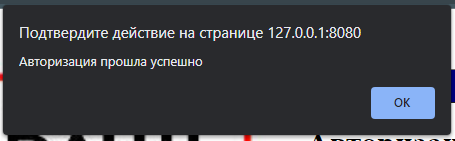
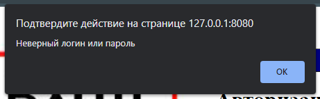
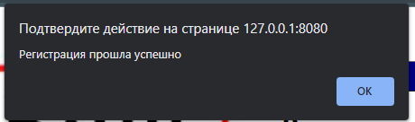
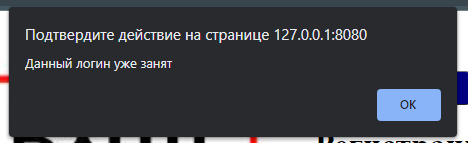
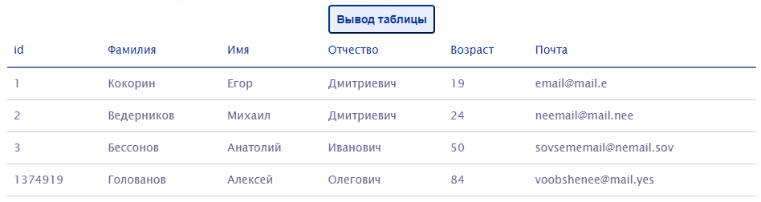
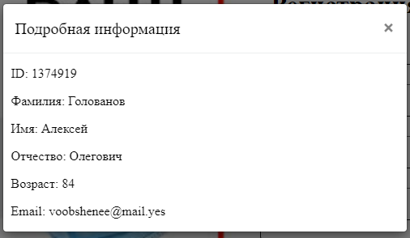
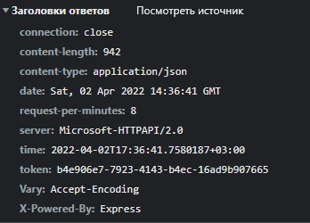

<p align = center>МИНИСТЕРСТВО НАУКИ И ВЫСШЕГО ОБРАЗОВАНИЯ

<p align = center>РОССИЙСКОЙ ФЕДЕРАЦИИ

<p align = center>ФЕДЕРАЛЬНОЕ ГОСУДАРСТВЕННОЕ БЮДЖЕТНОЕ ОБРАЗОВАТЕЛЬНОЕ УЧРЕЖДЕНИЕ ВЫСШЕГО ОБРАЗОВАНИЯ

<p align = center>«ВЯТСКИЙ ГОСУДАРСТВЕННЫЙ УНИВЕРСИТЕТ»

<p align = center>Институт математики и информационных систем

<p align = center>Факультет автоматики и вычислительной техники

<p align = center>Кафедра систем автоматизации управления
<br>
<br>
<br>
<br>

<p align = right>Дата сдачи на проверку:

<p align = right>«___» __________ 2022 г.

<p align = right>Проверено:

<p align = right>«___» __________ 2022 г.
<br>
<br>
<br>
<br>
<br>


<p align = center>Отчет по лабораторной работе № 7

<p align = center>по дисциплине

<p align = center>«Web-программирование»

<br>
<br>
<br>
<br>


<p align = center>Разработал студент гр. ИТб-2301-01-00 ________________ /Кокорин Е.Д./

<p align = center>Проверил ст. преподаватель _________________ /Земцов М.А./

<p align = center>Работа защищена с оценкой «___________» «___» __________ 2022 г.

<br>
<br>
<br>
<br>

<p align = center>Киров 2022

<hr>
Цель:  реализовать web-сервер на целевом языке программирования (C#)

Задачи:

1. Организовать процесс работы над лабораторной работой
1. Создать web-сервер на языке программирования C# без использования ASP.NET core.
1. Реализовать задание на третью и пятую лабораторные работы с использованием собственного сервера.
    - Реализовать проверку логина и пароля при авторизации.
    - Реализовать проверку уникальности логина при регистрации.
    - Реализовать вывод информации о студентах в таблицу.
    - Реализовать вывод информации о конкретном студенте.


Ход выполнения:

1. Организовать процесс работы над лабораторной работой

Для работы в репозитории *[ссылка на репозиторий](https://github.com/Danperad/WEB)* на сайте github.com была создана новая ветвь с названием lab7 от ветки lab5.

2. Создать web-сервер на языке программирования C# без использования ASP.NET core.

В ходе лабораторной работы было создано консольное приложение. Через NuGet пакеты добавлена библиотека RestPanda, основання на базе библиотеки HTTP.sys. Для выполнения запросов были созданы два класса-сущности: User и Stud. Листинг этих классов представлен в приложении А. В классе Program был реализован старт и остановка сервера, листинг этого класса представлен в приложении Б. Демонтсрация работы сервера представлена на рисунке 1.

<p align=center></p>
<p align = center>Рисунок 1 – web-сервер


3. Реализовать задание на третью и пятую лабораторные работы с использованием собственного сервера.

Для реализации соответствующих запросов были созданы два класса: AuthHandler и GetStudHandler. Листинг классов представлен в приложении В. Были созданы два Post-запроса для реализации задания на 3 лабараторную работу и один Get-запрос для реализации задания на 5 лабораторную работу, также была частично изменена структура компонентов из 3 и 5 лабораторных работ. полученные результаты отражены на рисунках 2-7. Для каждого запроса реализованы 3 заголовка(headers): время, токен, и частота запросов в минуту, результат отражен на рисунке 8.


<p align=center></p>
<p align = center>Рисунок 2 – Успешная авторизация

<p align=center></p>
<p align = center>Рисунок 3 – Неуспешная авторизация

<p align=center></p>
<p align = center>Рисунок 4 – Уникальный логин

<p align=center></p>
<p align = center>Рисунок 5 – Не уникальный логин

<p align=center></p>
<p align = center>Рисунок 6 – Таблица студентов

<p align=center></p>
<p align = center>Рисунок 7 – Подробная информация о студенте

<p align=center></p>
<p align = center>Рисунок 7 – Заголовки запроса

Вывод: в ходе выполнения лабораторной работы были получены данные с собственного web-сервера и организовано взаимодействие пользователя с ними.

<p align = center>Приложение А

<p align = center>(обязательное) 

<p align = center>Листинг классов User и Stud

```C#
using System.Text.Json;

namespace WebServer.Entity;

public class Stud
{
    public static List<Stud> Studs { get; } = new(new[]
    {
        new Stud(1, "Кокорин", "Егор", "Дмитриевич", 19, "email@mail.e"),
        new Stud(2, "Ведерников", "Михаил", "Дмитриевич", 24, "neemail@mail.nee"),
        new Stud(3, "Бессонов", "Анатолий", "Иванович", 50, "sovsememail@nemail.sov"),
        new Stud(1374919, "Голованов", "Алексей", "Олегович", 84, "voobshenee@mail.yes")
    });

    public int ID { get; set; }
    public string LastName { get; set; }
    public string FirstName { get; set; }
    public string MiddleName { get; set; }
    public int Age { get; set; }
    public string EMail { get; set; }

    public Stud()
    {
    }

    public Stud(int id, string lastName, string firstName, string middleName, int age, string eMail)
    {
        ID = id;
        LastName = lastName;
        FirstName = firstName;
        MiddleName = middleName;
        Age = age;
        EMail = eMail;
    }

    public static Stud? GetByID(dynamic id)
    {
        return Studs.FirstOrDefault(stud => stud.ID == id);
    }

    public static string Serialize(Stud stud)
    {
        return JsonSerializer.Serialize(stud);
    }
}
using System.Text.Json;

namespace WebServer.Entity;

public class User
{
    public static List<User> Users { get; } = new(new[] {new User("000000", "0000")});

    public string login { get; set; }
    public string pass { get; set; }

    public User()
    {
        login = "";
        pass = "";
    }

    public User(string login, string pass)
    {
        this.login = login;
        this.pass = pass;
    }

    public override bool Equals(object? obj)
    {
        if (obj is null) return false;
        var user = (User) obj;
        return user.login == login && user.pass == pass;
    }
}
```

<p align = center>Приложение Б

<p align = center>(обязательное) 

<p align = center>Листинг класса Program

```C#
using RestPanda;

namespace WebServer;

public class Program
{
    private static List<DateTime> _times = new();

    public static int GetTimes()
    {
        _times.Add(DateTime.Now);
        foreach (var time in _times.Where(time => (time - _times[^1]).Minutes >= 1))
        {
            _times.Remove(time);
        }

        return _times.Count;
    }

    public static void Main(string[] args)
    {
        const string url = "http://localhost:8888/";
        var server = new PandaServer(url, typeof(Program));
        server.Start();
        Console.WriteLine($"Start Listen at {url}");
        Console.WriteLine("Press Enter to stop server");
        Console.Read();
        server.Stop();
    }
}
```

<p align = center>Приложение В

<p align = center>(обязательное) 

<p align = center>Листинг классов AuthHandler и GetStudHandler

```C#
using RestPanda.Requests;
using RestPanda.Requests.Attributes;
using WebServer.Entity;

namespace WebServer.Requests;

[RequestHandler("/auth")]
public class AuthHandler
{
    [Post("/signin")]
    public static void SignIn(PandaRequest request, PandaResponse response)
    {
        response.AddHeader("Time", DateTime.Now.ToString("O"));
        response.AddHeader("Token", Guid.NewGuid().ToString());
        response.AddHeader("Request-Per-Minutes", Program.GetTimes().ToString());
        var user = request.GetObject<User>();
        if (user is null)
        {
            response.Send("Error");
            return;
        }
        if (User.Users.Contains(user))
        {
            response.Send(new {IsValid=true});
            return;
        }
        response.Send(new {IsValid=false});
    }
    
    [Post("/check")]
    public static void Check(PandaRequest request, PandaResponse response)
    {
        response.AddHeader("Time", DateTime.Now.ToString("O"));
        response.AddHeader("Token", Guid.NewGuid().ToString());
        response.AddHeader("Request-Per-Minutes", Program.GetTimes().ToString());

        var user = request.GetObject<User>();
        if (user is null)
        {
            response.Send("Error");
            return;
        }
        if (User.Users.Any(u => u.login == user.login))
        {
            response.Send(new {IsValid=false});
            return;
        }
        response.Send(new {IsValid=true});
    }
}
using RestPanda.Requests;
using RestPanda.Requests.Attributes;
using WebServer.Entity;

namespace WebServer.Requests;

[RequestHandler("/getstud")]
public class GetStudHandler
{
    [Get]
    public static void GetStuds(PandaRequest request, PandaResponse response)
    {
        response.AddHeader("Time", DateTime.Now.ToString("O"));
        response.AddHeader("Token", Guid.NewGuid().ToString());
        response.AddHeader("Request-Per-Minutes", Program.GetTimes().ToString());
        if (!request.Params.ContainsKey("id"))
        {
            response.Send(Stud.Studs);
            return;
        }
        var f = request.Params["id"];
        int start;
        if (f.Contains('-'))
        {
            var s = f.Split('-');
            if (!int.TryParse(s[0], out start) || !int.TryParse(s[1], out var stop))
            {
                response.Send("Error");
                return;
            }
            response.Send(Stud.Studs.Where(stud => stud.ID >= start && stud.ID <= stop));
            return;
        }

        if (!int.TryParse(f, out start))
        {
            response.Send("Error");
            return;
        }
        if (Stud.Studs.All(stud => stud.ID != start))
        {
            response.Send("Error");
            return;
        }
        response.Send(Stud.Studs.Single(stud => stud.ID == start));
    }
}
```